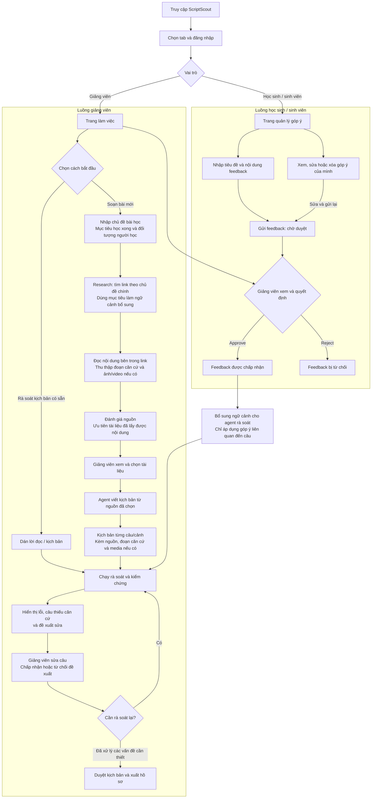

# Luồng hoạt động sản phẩm ScriptScout

ScriptScout giúp giảng viên tìm tài liệu, viết kịch bản có nguồn và rà soát từng câu. Học sinh/sinh viên gửi góp ý; giảng viên duyệt góp ý để agent sử dụng trong những lần rà soát tiếp theo.

## Sơ đồ tổng quan

## Giảng viên đi qua những bước nào?

1. Chọn tab giảng viên và đăng nhập để vào trang làm việc.
2. Chọn **Soạn bài mới** hoặc **Rà soát kịch bản có sẵn**.
3. Với bài mới, nhập chủ đề, mục tiêu học xong và đối tượng người học. Research lấy chủ đề làm trọng tâm, dùng mục tiêu để bổ sung ngữ cảnh tìm kiếm.
4. Hệ thống tìm link, đọc nội dung, thu thập đoạn căn cứ và ảnh/video nếu có, rồi đánh giá nguồn. Nội dung bị giới hạn truy cập hoặc yêu cầu đăng nhập có thể không lấy được.
5. Giảng viên xem và chọn tài liệu; agent viết kịch bản từ nguồn đã chọn, gắn nguồn và căn cứ cho các câu/cảnh khi có.
6. Giảng viên chạy rà soát, xem lỗi và đề xuất sửa. Kịch bản có sẵn được dán vào form và đi trực tiếp đến bước này.
7. Giảng viên sửa câu, chấp nhận hoặc từ chối đề xuất, rồi rà soát lại khi cần. Sau khi xử lý các vấn đề bắt buộc, giảng viên duyệt kịch bản và xuất hồ sơ.

## Học sinh / sinh viên đi qua những bước nào?

1. Chọn tab học sinh/sinh viên và đăng nhập để vào trang quản lý góp ý.
2. Nhập tiêu đề và nội dung feedback, rồi gửi. Feedback có trạng thái **chờ duyệt**.
3. Xem, sửa hoặc xóa góp ý của mình. Khi sửa, feedback trở về trạng thái **chờ duyệt**.
4. Giảng viên xem feedback và chọn **Approve** hoặc **Reject**.
5. Feedback được approve trở thành ngữ cảnh cho những lần rà soát tiếp theo; feedback bị reject không được đưa vào ngữ cảnh này.

## Agent hoạt động ra sao?

Luồng xử lý gồm **tìm kiếm → đọc tài liệu → đánh giá nguồn → viết từ nguồn đã chọn → rà soát và kiểm chứng**. Các bước này phối hợp công cụ tìm kiếm, bộ đọc nội dung, kiểm tra bằng code và LLM.

Khi viết, agent sử dụng nội dung và căn cứ của nguồn đã chọn. Khi rà soát, hệ thống kiểm tra lời đọc, câu thiếu căn cứ và dùng feedback đã duyệt để tìm vấn đề liên quan. Giảng viên quyết định chọn nguồn, sửa câu và duyệt kết quả cuối cùng.

## Feedback có tác dụng gì?

Feedback giúp agent nhận ra vấn đề từ góc nhìn người học. Ví dụ, góp ý **“Thuật ngữ này khó hiểu, cần giải thích trước khi dùng”** được approve sẽ giúp agent đề xuất bổ sung giải thích khi rà soát câu liên quan.

Theo triển khai hiện tại:

- Feedback đã approve được đưa vào **lần rà soát tiếp theo**, không tự sửa kịch bản.
- Feedback là ngữ cảnh góp ý; việc kiểm chứng sự thật vẫn dựa vào tài liệu và đoạn căn cứ.
- Agent chỉ áp dụng góp ý liên quan đến câu đang xét. Góp ý chung chung hoặc không liên quan không tự tạo thành lỗi.
- Sinh viên sửa feedback thì trạng thái trở về **chờ duyệt**, cần giảng viên duyệt lại.
- Feedback đã duyệt hiện được dùng chung khi rà soát, **chưa gắn riêng với từng bài học hoặc kịch bản**.
