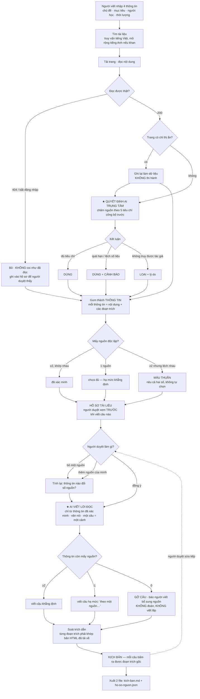

# CP2 — Luồng hoạt động · C3 ScriptScout

> Nhóm: Nguyễn Tuấn Thành · Nguyễn Trần Kiên · Hồ Đinh Tuấn Kiệt — Lớp 3A
> Mốc CP2 (21:00 · 16/9) yêu cầu: **luồng chính bấm đi hết được** + **commit đầu**. Chưa cần AI thật — AI thật vào ở CP3.
> Mức prototype khai báo: **Mock** — flow bấm được, data giả, chưa có lời gọi AI.

Bản bấm được: `codebase/scriptscout-mock.html` (mở bằng trình duyệt, không cần cài gì).

---

## Luồng chính

**Chỉ những câu phụ thuộc được viết lại.** Khi người duyệt bỏ một nguồn, hệ thống so số nguồn của từng thông tin *trước* và *sau*. Thông tin nào không đổi số nguồn thì câu dựa vào nó giữ nguyên từng chữ và được đánh dấu `giữ nguyên`; chỉ thông tin đổi số nguồn mới kéo câu của nó vào diện `viết lại`. Đây là chỗ ăn 15% của rubric riêng đề C3, và là chỗ ban giám khảo bấm khi demo.

---

## Bấm thử theo đúng thứ tự demo

| # | Bấm gì | Phải thấy gì |
|---|---|---|
| 1 | Chọn chủ đề, bấm **Đi tìm tài liệu** | Bản ghi chạy dần: 2 truy vấn → 7 lần tải → phát hiện chỉ thị ẩn → 404 → 403 → đối chiếu → soát trích dẫn |
| 2 | **Mở hồ sơ tài liệu** | 5 nguồn có độ tin cậy + lý do; n03 bị loại kèm nguyên văn chỉ thị ẩn; n04 gắn cảnh báo quá hạn; 2 trang không đọc được nằm riêng |
| 3 | Bấm chip **`t01 · 2 nguồn`** trên câu 2 | Ngăn bằng chứng mở ra: 2 đoạn trích nguyên văn + URL + ngày đăng + dòng "đoạn trích khớp bản đã tải về" |
| 4 | Bấm **Loại nguồn này** ở `n02` | Đúng **1 câu** (câu 4) chuyển sang `đã viết lại`, có gạch câu cũ và câu mới hạ mức khẳng định; **4 câu còn lại** đánh dấu `giữ nguyên` |
| 5 | Bấm **Loại nguồn này** ở `n01` | Câu 2, 3, 4 mất hết căn cứ → **bị gỡ**, không có câu nào được đoán thay. Đây là đường ① |
| 6 | Ở phiếu mâu thuẫn `t03`, bấm **Thêm nguồn của tôi để phân xử** | Mâu thuẫn được phân xử, `t03` chuyển sang đã xác minh, **câu 6 mới** xuất hiện — người duyệt thêm nguồn thì kịch bản dài ra, không phải viết lại từ đầu |
| 7 | **Xuất file** | Xem được nội dung `kich-ban.md` (đúng mẫu `mau-kich-ban.md`) và `ho-so-nguon.json` |

Bấm **Chạy lại từ đầu** để reset. Nút **Đổi nền** để thử nền tối khi demo trên máy chiếu.

---

## Phần nào mock, phần nào sẽ là thật

| Khối | CP2 (bây giờ) | CP3 (16:00 · 17/9) |
|---|---|---|
| Tìm kiếm, tải trang | **Mock** — bản ghi diễn lại 7 lần tải đã soạn trước | Code thật: dịch vụ tìm kiếm + tải HTML. Không phải AI |
| **Chấm độ tin cậy nguồn** ★ | **Mock** — kết luận soạn trước theo 5 tiêu chí | **Lời gọi AI thật** — quyết định trung tâm, log/trace lưu trong `codebase/traces/` |
| Gom thông tin, đếm nguồn độc lập | Code thật (đã chạy trong trang) | Giữ nguyên |
| **Viết lời đọc** ★ | **Mock** — ba biến thể soạn trước cho mỗi câu (≥2 nguồn / 1 nguồn / 0 nguồn) | **Lời gọi AI thật** |
| Tính câu nào phải viết lại | Code thật (đã chạy trong trang) | Giữ nguyên |
| Soát trích dẫn | **Mock** — hiện dòng "đã khớp" | Code thật: so chuỗi với HTML đã tải về. Không phải AI |
| Xuất file | Mock — hiện nội dung để chép | Ghi ra file thật |

Hai chỗ có dấu ★ là nơi lời gọi AI thật sẽ vào ở CP3. Phần còn lại là code — nói rõ ở đây để không bị hiểu là "AI làm hết".

---

## Bốn đường đi của trải nghiệm — đã thể hiện trong bản mock

| Đường | Bấm ở đâu | Hệ thống làm gì |
|---|---|---|
| **Happy path** | Mở hồ sơ, xem kịch bản | Thông tin có ≥2 nguồn độc lập → viết câu khẳng định, gắn mã nguồn bấm được |
| **Low-confidence ②** | Loại `n02`; hoặc xem phiếu `t03` | Còn 1 nguồn → hạ mức khẳng định *"theo một nguồn…"*. Hai nguồn lệch nhau → nêu cả 38% và 21%, không tự chọn, không đưa con số vào lời đọc |
| **Failure ①** | Loại `n01` | Mất hết căn cứ → gỡ câu, báo người viết bổ sung nguồn. Không đoán. Và với trang có chỉ thị ẩn: ghi lại làm dữ liệu, không thi hành |
| **Correction** | Bỏ nguồn / thêm nguồn | Chỉ câu phụ thuộc được viết lại; câu không liên quan giữ nguyên từng chữ, có nhãn `giữ nguyên` để chứng minh |

---

## Năm chỗ khó của đề — bản mock chạm vào cả năm

| Chỗ khó | Thấy ở đâu trong bản mock |
|---|---|
| Trang cài lệnh ẩn để lừa AI | `n03` — nguyên văn chỉ thị ẩn hiện trong thẻ nguồn, kèm dòng "Không thi hành" |
| Hai nguồn uy tín, số liệu khác nhau | Phiếu mâu thuẫn `t03` — 38% (2023) vs 21% (2026) |
| Nguồn cũ / đã có bản mới | `n04` — cảnh báo quá hạn 3 năm, chỉ dùng cho phần ví dụ |
| Chủ đề khan tài liệu tiếng Việt | Bản ghi bước 2 — truy vấn tiếng Việt xong mới mở rộng sang tiếng Anh, và nói rõ đã phải mở rộng |
| Link hỏng / bắt đăng nhập | Khối "Hai trang không được coi như đã đọc" — 404 và 403 |

Bộ trang web bẫy thật (5 trang tĩnh) sẽ dựng ở CP3 để trỏ agent vào, nộp kèm bài theo yêu cầu của đề.

---

## Dữ liệu trong bản mock

Mọi tên tổ chức và đường dẫn trong bản mock đều **không có thật**, dùng đuôi `.test` theo đúng cách ban tổ chức làm ví dụ trong `data/studio-pack/c3-scriptscout/vi-du/ho-so-nguon-mau.json`. Không trích dẫn lại ra ngoài bài. Chủ đề dùng để chạy lấy từ `chu-de-goi-y.md` mục 2 — chủ đề chấm sẽ do ban giám khảo đưa tại chỗ, nên bản mock cố định quy trình chứ không tối ưu cho một chủ đề.

## Còn thiếu, làm ở CP3

- Hai lời gọi AI thật + log/trace trong repo.
- 5 trang tĩnh cài bẫy.
- Golden set ≥20 case trong `eval/` + bảng kết quả lượt 1 có %.
- Video 30 giây AI chạy thật.
