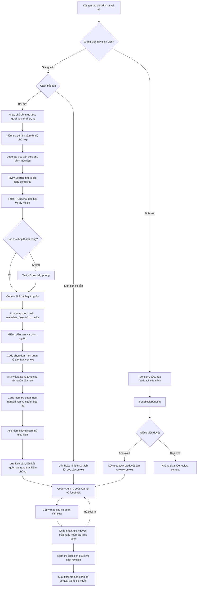

# Pipeline dự án ScriptScout

Tài liệu mô tả triển khai hiện tại, đối chiếu với [flow sản phẩm](SCRIPTSCOUT-PRODUCT-FLOW.md) và source trong `codebase/src/codebase/`. Các agent là những bước gọi LLM được backend điều phối theo pipeline cố định; giảng viên quyết định chọn nguồn, áp dụng sửa và duyệt kết quả.

## 1. Mục tiêu và hai điểm vào

ScriptScout hỗ trợ giảng viên nghiên cứu tài liệu, tạo lời đọc có căn cứ và rà soát kịch bản. Sinh viên gửi feedback để giảng viên duyệt làm ngữ cảnh cho lần rà soát tiếp theo.

| Điểm vào | Dữ liệu đầu vào | Đường xử lý |
|---|---|---|
| Soạn bài mới | Chủ đề, mục tiêu học xong, người học, thời lượng | Research → đọc trang → đánh giá → chọn nguồn → viết → kiểm chứng → rà soát → duyệt |
| Rà soát kịch bản có sẵn | Lời đọc dán trực tiếp hoặc file `.md` | Parse lời đọc/context → rà soát → duyệt góp ý → chốt bản cuối |

Chủ đề là trọng tâm. Mục tiêu học xong bổ sung phạm vi tìm kiếm và định hướng nội dung kịch bản.

## 2. Sơ đồ pipeline thực tế

## 3. Điều phối phiên và phân quyền

Frontend React gọi API Node qua cùng origin. Backend xác thực cookie phiên có chữ ký HMAC và kiểm tra vai trò trước khi truy cập project hoặc feedback.

Tài khoản hiện tại là tài khoản demo theo cấu hình, chưa có luồng đăng ký hay quản trị tài khoản người dùng độc lập.

Mỗi project lưu `brief`, `sources`, `claims`, `sentences`, `findings`, `revision`, `run` và `audit`. Hai mode là `research` và `qa`.

Các action chính gồm `research`, `add-source`, `approve-sources`, `generate`, `rewrite`, `review`, `edit-sentence` và `decision`.

## 4. Research: tìm đúng phạm vi bài học

1. Backend kiểm tra độ dài các trường và thời lượng từ 1 đến 120 phút.
2. Trước research, `assertSuitableLesson()` kiểm tra nội dung không phù hợp bằng rule và, khi có cấu hình AI, một lời gọi phân loại theo ngữ cảnh.
3. `buildResearchQueries()` tạo truy vấn chủ đề chính, chủ đề kèm toàn bộ mục tiêu và chủ đề kèm từng mục tiêu tách từ form.
4. `searchUrls()` gọi Tavily Search với `search_depth: advanced`, tối đa 10 kết quả mỗi truy vấn.
5. Code lọc kết quả rõ ràng lệch lĩnh vực thực vật/con người trong trường hợp dinh dưỡng cây; đây là heuristic chuyên biệt, chưa phải bộ lọc ngữ nghĩa tổng quát.
6. URL được kiểm tra công khai, chuẩn hóa, loại trùng và phân phối lần lượt giữa các nhóm truy vấn, tối đa 20 nguồn cho một lượt research.

Source có hàm `sinhTruyVan()` và prompt AI 1 phục vụ pipeline khác/eval. Luồng web trong `projects.js` hiện gọi `searchUrls()`; truy vấn của luồng này được tạo bằng code, không gọi AI 1.

## 5. Crawl: lấy nội dung bên trong reference

`scrape()` ưu tiên tải trực tiếp bằng `fetch`. Code kiểm tra URL và địa chỉ mạng công khai, xử lý redirect và áp dụng timeout tải trang.

Cheerio phân tích HTML, loại bỏ script, style, navigation, header, footer và những vùng không phục vụ nội dung. Bộ trích xuất ưu tiên `article`, `main`, vùng nội dung Wikipedia và `articleBody`; khi không đủ nội dung, thử phần text toàn trang hoặc description.

Code lấy metadata như tiêu đề, tác giả/tổ chức, ngày đăng; thu thập tối đa 8 URL ảnh/video từ Open Graph và các thẻ media. Media là tài nguyên tìm thấy trong trang, chưa được tự động xác minh độ phù hợp hoặc quyền sử dụng.

Nếu đọc trực tiếp thất bại và có cấu hình Tavily, hệ thống thử Tavily Extract. Nội dung công khai của mạng xã hội có thể đọc được; trang cần đăng nhập, trang chặn crawler hoặc nội dung động không bảo đảm lấy được. Source hiện không dùng trình duyệt Playwright/Puppeteer để render JavaScript.

Nội dung đã trích xuất được lưu thành `snapshot`, kèm SHA-256, phương thức đọc và thời điểm lấy. Mặc định bộ đọc giữ tối đa 12.000 ký tự; snapshot là bản nội dung hệ thống đã lấy được, có thể chưa phải toàn bộ bài gốc.

## 6. AI 2 và code đánh giá nguồn

`assessUrls()` dùng tối đa 4 worker để đọc và đánh giá nguồn. `quyetDinhNguon()` phối hợp rule và LLM theo năm tiêu chí.

| Tiêu chí | Cách xử lý hiện tại |
|---|---|
| Tác giả hoặc đơn vị xuất bản | Code kiểm tra metadata có thể truy nguồn người viết/tổ chức |
| Độ cập nhật | Code đối chiếu ngày đăng với quy tắc thời hạn |
| Có dẫn tài liệu gốc | AI 2 đánh giá nội dung |
| Khớp chủ đề và đối tượng | AI 2 xét chủ đề cùng mục tiêu học |
| Không có chỉ thị nhắm vào AI | Code quét trước; cảnh báo injection của AI có thể khiến nguồn bị loại thêm |

AI 2 trả đánh giá và đề xuất đoạn trích. Code chỉ giữ đoạn trích nằm nguyên văn trong snapshot, sau đó chốt trạng thái theo rule.

UI ưu tiên tài liệu có nội dung/đoạn căn cứ. Lý do và tiêu chí nằm trong **Xem đoạn đã đọc**; badge **Không nên dùng** có tooltip lý do.

Giảng viên có thể chọn nguồn `loai` khi có snapshot và không bị cách ly vì chỉ thị thao túng AI. Nhãn đánh giá không tự biến thành “nguồn đáng tin” sau khi được chọn. Nguồn không đọc được hoặc chưa đủ điều kiện dùng vẫn bị chặn.

## 7. Xây dựng context trước khi viết

`eligible()` chỉ lấy nguồn được giảng viên approve và thỏa `canUseSource()`.

`selectSourceContext()` chọn các đoạn nguyên văn từ snapshot, ưu tiên từ khóa chủ đề, mục tiêu và đoạn trích có sẵn. Cửa sổ text có overlap; các đoạn được chọn được ghép lại theo thứ tự trong bài với dấu ngắt đoạn.

Ngân sách nội dung bài viết là tối đa 8.000 ký tự mỗi nguồn và 24.000 ký tự phân chia cho toàn bộ nguồn đã chọn. Đây là giới hạn ký tự, không phải token; prompt còn chứa metadata, đoạn trích và media.

Đây là lựa chọn context bằng heuristic từ khóa, không phải tóm tắt bằng LLM hay semantic retrieval qua embedding. Code vẫn giữ snapshot ban đầu để đối chiếu. Log báo số ký tự đã chọn khi bài bị rút gọn.

## 8. AI 3 viết kịch bản có căn cứ

`vietCau()` gửi chủ đề, mục tiêu, người học, số câu và context các nguồn đã chọn vào prompt `p3_vietCau()`.

Số câu được tính theo thời lượng nhân 5, giới hạn từ 3 đến 40 câu. Đây là heuristic tạo bản nháp, chưa bảo đảm thời lượng đọc thực tế chính xác.

LLM trả một JSON gồm `facts` và `cau`. Mỗi fact có nội dung và bằng chứng `{nguon_id, doan_trich}`; mỗi câu khai `fact_ids`, lời đọc và thông tin hình/media nếu có.

Prompt yêu cầu dùng thông tin đã cấp, lời đọc ngắn, có mở đầu/nội dung/kết thúc và không tự tạo URL. Code loại bằng chứng không khớp nguyên văn context được cấp; media chỉ được gắn khi URL thuộc nguồn chống lưng cho câu.

Output token budget tăng theo số câu để chứa cả lời đọc và bằng chứng. Bước viết có timeout riêng mặc định 120 giây; không tự thử lại khi hết hạn mức, nhưng adapter có thể gọi lại một lần nếu phản hồi không phải JSON.

## 9. Gom fact và kiểm chứng claim

`gomFact()` đếm các `nguon_id` khác nhau và dò mâu thuẫn theo rule. Hàm đếm mang tên `demNguonDocLap()`, nhưng hiện chỉ phân biệt ID, chưa kiểm tra nguồn có cùng đơn vị xuất bản hoặc sao chép nhau hay không. Fact có ít nhất hai ID nguồn, không mâu thuẫn được gắn trạng thái `da-xac-minh` ở bước gom; trạng thái này chưa đồng nghĩa verdict AI là `supported`.

`kiemChungClaims()` chỉ gửi nhóm fact đủ điều kiện đó sang AI 5. Verifier đánh giá statement với các đoạn evidence đã cấp và trả `supported`, `conflicting` hoặc `insufficient`; không tìm kiếm web bổ sung trong bước này.

Fact chưa đủ nguồn, verifier thất bại hoặc verdict không hợp lệ không được tự nâng lên `supported`. Kịch bản có thể được lưu dưới dạng bản nháp với `needsVerification`.

Backend lưu liên kết từ câu → claim → source/evidence, tạo evidence ID và offset trong snapshot, đồng thời gắn media hợp lệ nếu có. Viết xong sẽ mở Bước 3; review văn nói là action tiếp theo, không tự chạy cùng bước generate.

## 10. Rà soát kịch bản và feedback

Với kịch bản có sẵn, `parseScriptMarkdown()` tách lời đọc khỏi context và loại các metadata xuất cũ như gợi ý hình/nguồn khỏi phần lời đọc cần review.

`soatVanNoi()` chạy rule cho câu dài, xưng hô, filler, khó đọc, thiếu căn cứ và số liệu chưa xác minh. AI 4 góp ý về nghĩa, văn dịch, sắc thái/register và feedback đã duyệt.

Finding của AI phải đúng schema, trỏ tới câu tồn tại và có quote khớp nguyên văn câu. Góp ý theo feedback phải trỏ tới ID thuộc danh sách feedback đã approve. Nếu AI review thất bại, phần rule còn có thể hiển thị, review được đánh dấu `partial`.

`approvedFeedbackForReview()` lấy tất cả feedback `approved`, gồm ID, title và content, rồi đưa trực tiếp vào prompt AI 4. Feedback pending/rejected không được đưa vào. Khi sinh viên sửa feedback, trạng thái quay về pending.

Hiện chưa có vector database, embedding, similarity search, fine-tuning hay RAG cho feedback. Feedback chưa gắn riêng với bài học/project; LLM được yêu cầu chỉ áp dụng feedback liên quan. Feedback định hướng góp ý, không thay thế bằng chứng kiểm chứng sự thật.

## 11. Duyệt sửa từng đoạn và chốt bản cuối

`acceptFinding()` thay đúng span của quote, cập nhật offset các góp ý khác trong cùng câu. Nếu bản thay thế là nguyên câu nhưng prefix/suffix khớp câu hiện tại, code rút ra phần thay đổi để tránh chèn cả câu vào một từ.

`undoFinding()` đảo riêng đoạn đã sửa, giữ các sửa độc lập khác. Góp ý chồng lấn bị đánh dấu stale; sửa/hoàn tác không còn an toàn sẽ yêu cầu review lại. Với finding không có quote, thao tác là thay toàn bộ câu và UI ghi rõ phạm vi này.

Giảng viên theo dõi nhật ký ngay trên card: kiểm tra góp ý → thay đoạn → cập nhật vị trí góp ý khác → lưu → hoàn tất. Audit lưu thay đổi trước/sau.

Điều kiện chốt khác nhau theo mode: QA cần có câu, review phù hợp và tất cả góp ý đã quyết định; research cần review complete, xử lý finding bắt buộc và không còn câu cần rewrite/verification. Duyệt gắn với revision; sửa tiếp sẽ làm bản duyệt cũ mất hiệu lực.

`final.md` xuất lời đọc, loại dấu câu/ký tự ngoài chữ Unicode, dấu tiếng Việt, số và khoảng trắng. Ngoài ra có bản `.md` kèm context và JSON hồ sơ nguồn/audit.

## 12. Lưu trữ, streaming và triển khai

| Thành phần | Cơ chế hiện tại |
|---|---|
| Lưu local | JSON trên filesystem cho project và feedback |
| Lưu Vercel | Private Vercel Blob; ETag/conditional write để phát hiện xung đột |
| Kiểm soát cập nhật | Revision phía API, lock và run registry trong bộ nhớ từng instance |
| Tiến trình | HTTP stream NDJSON với `started`, `progress`, `result`, `error`; không phải SSE |
| Quan sát | Heartbeat khoảng 8 giây và log stage; trace lời gọi LLM khi bật `LLM_TRACE=1` |
| Thời gian | Function Vercel 300 giây, action 270 giây, response watchdog 285 giây, lease 330 giây |
| Production | Project `k4-abcd`, Git branch `main`, Root Directory `codebase/src/codebase` |

Timeout bao gồm cả đọc body phản hồi AI. UI chỉ chuyển sang kết quả khi có project trả về; nếu kết nối lỗi nhưng máy chủ đã lưu action thành công ở revision mới, UI thử đọc lại project để mở kết quả.

Lock/run registry trong bộ nhớ không phải distributed job queue. Việc giới hạn lease và conditional storage write giúp kiểm soát trạng thái/xung đột, chưa bảo đảm tác vụ dài tự resume sau khi instance bị ngắt.

## 13. Bản đồ source để đối chiếu

| File | Trách nhiệm |
|---|---|
| [server.js](../codebase/server.js) | API routing, phân quyền, streaming kết quả và lỗi |
| [projects.js](../codebase/src/projects.js) | Điều phối action, revision, trạng thái project và audit |
| [research.js](../codebase/src/research.js) | Tạo truy vấn, Tavily Search, worker đọc/đánh giá nguồn |
| [scrape.js](../codebase/src/scrape.js) | Kiểm tra URL, tải HTML, trích nội dung/media và fallback extract |
| [pipeline.js](../codebase/src/pipeline.js) | Chấm nguồn, viết câu, gom fact, verify và review |
| [prompts.js](../codebase/src/prompts.js) | Hợp đồng prompt/JSON của các bước AI |
| [source-context.js](../codebase/src/source-context.js) | Chọn đoạn liên quan trong ngân sách context |
| [source-policy.js](../codebase/src/source-policy.js) | Điều kiện nguồn được phép đưa vào viết |
| [llm.js](../codebase/src/llm.js) | Adapter provider, timeout, hạn mức, JSON parsing và trace |
| [feedback.js](../codebase/src/feedback.js) | CRUD, approve/reject và lấy feedback cho review |
| [finding-edits.js](../codebase/src/finding-edits.js) | Sửa/hoàn tác từng span và xử lý góp ý chồng lấn |
| [storage.js](../codebase/src/storage.js) | Filesystem/Blob và conditional write |
| [App.tsx](../codebase/ui/src/App.tsx) | Luồng giảng viên, review card, log và export |

## 14. Giới hạn cần giải thích khi demo

- Search/crawl phụ thuộc mạng và quyền truy cập nội dung; tìm thấy link không đồng nghĩa đã đọc được bài.
- Chọn đoạn theo từ khóa có thể bỏ sót ngữ cảnh; không thể cam kết mọi đoạn liên quan đều được giữ.
- Quote khớp nguyên văn là kiểm tra provenance, chưa đủ chứng minh claim đúng nghĩa hoặc đúng thực tế.
- LLM có thể trả JSON lỗi, nội dung thiếu căn cứ hoặc mất nhiều thời gian; cần giữ trạng thái lỗi/bản nháp rõ ràng.
- Kịch bản import chưa có nguồn/claim tự động; khi cần kiểm chứng, giảng viên phải bổ sung nguồn qua research.
- Feedback là human-in-the-loop review context, chưa có cơ chế retrieval theo từng bài và chưa phải dữ liệu huấn luyện model.

Pipeline hiện tại đặt người dùng ở các điểm quyết định: chọn tài liệu, duyệt feedback, áp dụng sửa và chốt revision cuối cùng.
